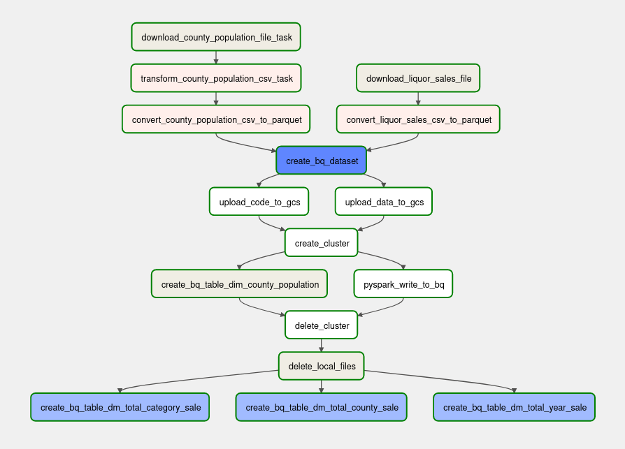
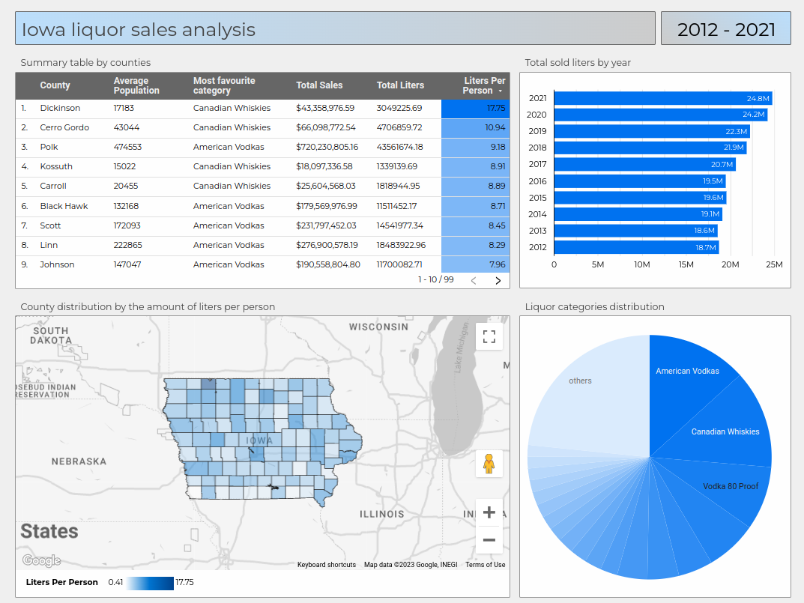

# Data Engineering Zoomcamp Project

## About

## Techologies

- Python
- Apache Airflow
- Apache Spark
- Google Cloud Storage
- Google BigQuery
- Google Dataproc
- Docker
- Terraform
- Dbt
- Looker Studio

## Overview



[Iowa Liquor Dashboard](https://lookerstudio.google.com/reporting/892c0980-dfa2-4958-8805-d969eda06ab3)



## How to reproduce the project

1. If you don't have a Google Cloud Platform account, [create one now](https://console.cloud.google.com/freetrial/). This project can be reproduced using only the services included in the GCP [free tier](https://cloud.google.com/free/).

2. [Create a GCP Project](https://console.cloud.google.com/projectcreate).

3. Make sure that you have selected this new project.

4. [Enable Google Compute Engine API](https://console.developers.google.com/apis/library/compute.googleapis.com) for your project in the GCP console.

5. [Enable Cloud Dataproc API](https://console.cloud.google.com/marketplace/product/google/dataproc.googleapis.com) for your project in the GCP console.

6. [Create a service account key](https://console.cloud.google.com/apis/credentials/serviceaccountkey) with the following settings:
   - Click "Create Service Account".
   - Give it any name you like and click "Create and continue".
   - For the Role, choose "Project -> Editor", then click "Continue".
   - Skip granting additional users access, and click "Done".

7. After you create your service account, download your service account key.
   - Select your service account from the list.
   - Select the "Keys" tab.
   - In the drop down menu, select "Create new key".
   - Leave the "Key Type" as JSON.
   - Click "Create" to create the key and save the key file to your system.
   - Rename this key file to **google_credentials.json**

8. [Create an SSH key pair](https://cloud.google.com/compute/docs/connect/create-ssh-keys#create_an_ssh_key_pair) (if you haven't created it already).
   - KEY_FILENAME: the name for your SSH key file.
   - USERNAME: your username on the VM.

      ```bash
      ssh-keygen -t rsa -f ~/.ssh/<KEY_FILENAME> -C <USERNAME> -b 2048
      ```

9. [Add SSH keys to project metadata](https://cloud.google.com/compute/docs/connect/add-ssh-keys#add_ssh_keys_to_project_metadata).
   - In the Google Cloud console, go to the [Metadata](https://console.cloud.google.com/compute/metadata/sshKeys?_ga=2.84082073.1017998736.1680528409-313645582.1673880440) page.
   - Click the SSH keys tab.
   - Click Edit.
   - Click Add item. A text box opens.
   - Copy the contents of your public SSH key (```~/.ssh/<KEY_FILENAME>.pub```).
   - Paste the contents in the text box (```ssh-rsa AAAAB3NzaC1yc2 ... UdMvQMCk= <USERNAME>```).
   - Click "Save"

10. [Create a GCP VM instance](https://console.cloud.google.com/compute/instancesAdd) with the following parameters.

    - **Name**: Instance name.
    - **Region**: europe-west6 (or choose another region)
    - **Zone**: europe-west6-a (or choose another zone)
    - **Machine configuration**:
      - **Series**: E2
      - **Machine type**: e2-standart-2 (2 vCPU, 8 GB memory)
    - **Boot disk**:
      - **Operating system**: Ubuntu
      - **Version**: Ubuntu 18.04 LTS
      - **Size** (GB): 20 GB
    - **Service account**: Choose the service account which was created in section 5

11. Copy an External IP of this VM and create or update an existing ssh configuration file ```~/.ssh/config```:

    - REMOTE_HOST: the name of the VM (you will use this name wnen connecting to the VM using ssh or sftp commands)
    - EXTERNAL_IP: external IP from GCP VM instances
    - KEY_FILENAME: the name for your SSH key file.
    - USERNAME: your username on the VM.

      ```bash
      touch ~/.ssh/config

      echo \
      '
      Host <REMOTE_HOST>
            HostName <EXTERNAL_IP>
            User <USERNAME>
            IdentityFile ~/.ssh/<KEY_FILENAME>
            LocalForward 8080 localhost:8080 # Airflow UI
      ' >> ~/.ssh/config     
      ```

      ```bash
      # Example of how ~/.ssh/config should be look like.
      Host iowa-instance
            HostName 34.65.66.223
            User iowa
            IdentityFile ~/.ssh/iowa
            LocalForward 8080 localhost:8080 # Airflow UI
      ```

12. Copy your GCP service account key file to the VM using scp.
      - REMOTE_HOST: the name of the VM from ```~/.ssh/config```
      - GCP_SERVICE_ACCOUNT_KEY: a full path to a key file which you have downloaded and renamed to "google_credentials.json" wnen creating a GCP service account in section 6. In my case it was saved to ```/home/aerik/downloads/google_credentials.json``` and the command should be ```scp -r ~/downloads/google_credentials.json iowa-instance:~/.google/credentials/google_credentials.json```.

      ```bash
      ssh <REMOTE_HOST> 'mkdir -p ~/.google/credentials'
      scp -r <GCP_SERVICE_ACCOUNT_KEY> <REMOTE_HOST>:~/.google/credentials/google_credentials.json
      ```

13. Connect to the VM using ssh.
      - REMOTE_HOST: the name of the VM from ```~/.ssh/config```

      ```bash
      ssh <REMOTE_HOST>
      ```

14. Provide your service account credentials to Google Application Default Credentials.

      ```bash
      echo 'export GOOGLE_APPLICATION_CREDENTIALS="${HOME}/.google/credentials/google_credentials.json"' >> ~/.bashrc
      source ~/.bashrc
      gcloud auth application-default login 
      ```

15. Update, upgrade and install packages.

      ```bash
      sudo apt update && sudo apt upgrade
      sudo apt install wget gnome-keyring ca-certificates curl gnupg
      ```

16. [Install Terraform](https://developer.hashicorp.com/terraform/downloads).

      ```bash
      wget -O- https://apt.releases.hashicorp.com/gpg | sudo gpg --dearmor -o /usr/share/keyrings/hashicorp-archive-keyring.gpg
      echo "deb [signed-by=/usr/share/keyrings/hashicorp-archive-keyring.gpg] https://apt.releases.hashicorp.com $(lsb_release -cs) main" | sudo tee /etc/apt/sources.list.d/hashicorp.list
      sudo apt update && sudo apt install terraform
      ```

17. [Install Docker](https://docs.docker.com/engine/install/ubuntu/).

      ```bash
      sudo mkdir -m 0755 -p /etc/apt/keyrings
      curl -fsSL https://download.docker.com/linux/ubuntu/gpg | sudo gpg --dearmor -o /etc/apt/keyrings/docker.gpg

      echo \
      "deb [arch="$(dpkg --print-architecture)" signed-by=/etc/apt/keyrings/docker.gpg] https://download.docker.com/linux/ubuntu \
      "$(. /etc/os-release
      echo "$VERSION_CODENAME")" stable" | \
      sudo tee /etc/apt/sources.list.d/docker.list > /dev/null

      sudo chmod a+r /etc/apt/keyrings/docker.gpg
      sudo apt update
      sudo apt install docker-ce docker-ce-cli containerd.io docker-buildx-plugin docker-compose-plugin
      ```

18. [Install docker-compose](https://github.com/docker/compose#where-to-get-docker-compose).

      ```bash
      mkdir -p "${HOME}/.docker/cli-plugins" && cd "${HOME}/.docker/cli-plugins"
      wget https://github.com/docker/compose/releases/download/v2.17.2/docker-compose-linux-x86_64 -O docker-compose
      chmod +x docker-compose
      echo 'export PATH="${PATH}:${HOME}/.docker/cli-plugins"' >> ~/.bashrc
      source ~/.bashrc
      ```

19. [Linux post-installation steps for Docker](https://docs.docker.com/engine/install/linux-postinstall/).

      ```bash
      sudo groupadd docker
      sudo usermod -aG docker $USER
      ```

20. Restart your VM, connect back and then restart the docker service.

      ```bash
      sudo reboot
      ```

      ```bash
      ssh <REMOTE_HOST>
      ```

      ```bash
      sudo service docker restart
      ```

21. Clone the repo and add your user ID into the .env.

      ```bash
      cd ~
      git clone https://github.com/aeryuzhev/de-zoomcamp-project.git
      cd de-zoomcamp-project/airflow
      echo -e "AIRFLOW_UID=$(id -u)" > .env
      ```

22. Open **~/de-zoomcamp-project/airflow/dags/config/dag.py** and write your GCP_PROJECT_ID and GCP_REGION. [Here you can take your GCP project ID](https://console.cloud.google.com/cloud-resource-manager)

      ```bash
      nano ~/de-zoomcamp-project/airflow/dags/config/dag.py
      ```

      ```python
      GCP_PROJECT_ID = <GCP_PROJECT_ID>
      GCP_REGION = <GCP_REGION>    
      ```

23. Create GCP resources (GCS bucket and BigQuery dataset) using Terraform.

      ```bash
      cd ~/de-zoomcamp-project/terraform
      terraform init
      ```

      - GCP_PROJECT_ID: [GCP project ID](https://console.cloud.google.com/cloud-resource-manager).
      - GCP_REGION: GCP region (optional, default: europe-west6)

      ```bash
      terraform plan -var="project=<GCP_PROJECT_ID>" -var="region=<GCP_REGION>" -out=tfplan
      ```

      ```bash
      terraform apply tfplan
      ```

24. Run Airflow in Docker.

      ```bash
      cd ~/de-zoomcamp-project/airflow
      docker-compose up -d
      ```

25. Open Airflow UI ```localhost:8080``` in your browser, start the **iowa_liquor_sales_dag** and wait until it finishes. It will run for about 40 min, because it downloads a ~6gb csv file. When it finishes you'll be able to build your own dashboard based on data from BigQuery dataset.

| :warning: WARNING                                                             |
|:------------------------------------------------------------------------------|
| Don't forget to ```terraform destroy``` (delete GCS bucket and BigQuery dataset) and to ```sudo shutdown``` (stop your VM) to save money on the account. |
