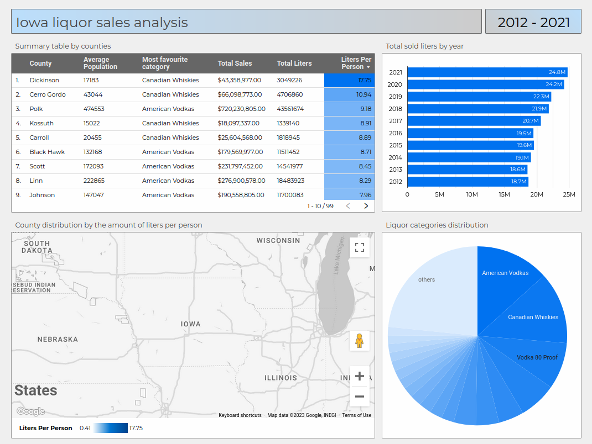

# Data Engineering Zoomcamp Project

## Techologies

* Python
* Apache Airflow
* Apache Spark
* Google Cloud Storage
* Google BigQuery
* Google Dataproc
* Docker
* Terraform
* Dbt
* Looker Studio

## Apache Airflow

## Looker

[Iowa Liquor Dashboard](https://lookerstudio.google.com/reporting/892c0980-dfa2-4958-8805-d969eda06ab3)

## How to reproduce the project

[Step by step guide](how_to_reproduce.md)
